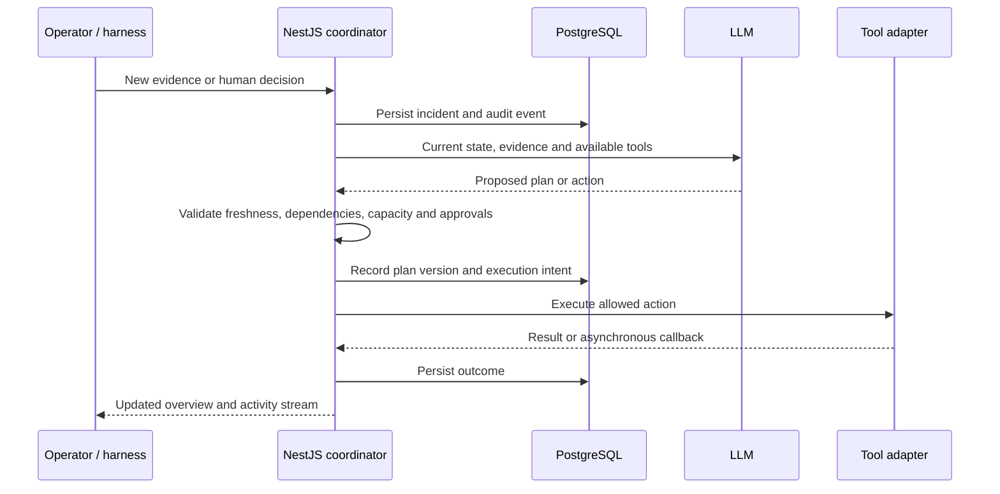

# Casa Pepe architecture

## System map

The model selects investigation and recovery actions; server code enforces the execution constraints. New evidence can invalidate pending work and supersede approvals. Verification is a separate action from execution. Human task creation records ownership; it does not establish that the task was completed.

## Model transport and plan constraints

The LLM client limits completed JSON responses and reconstructed streamed answers to 1 MiB. Streaming has a separate 16 MiB transport budget because SSE repeats metadata for each token and may carry private reasoning that the parser discards. Each frame and accumulated public content/tool arguments remain bounded to 1 MiB; timeouts, token limits, completion validation and stream cleanup still apply. Transport failures are classified separately from confirmed size-limit failures, without exposing raw provider error text.

Every commander turn receives `planConstraints`, derived from the same backup selection and effective-capacity functions used by plan repair. It identifies the current region, committed and available units, and the execution/verification dependency IDs and approval requirements for each service. This makes the existing single-region planning contract explicit: a model cannot pool backup regions or budget against a larger region while the runtime selects another. Rejected proposals request a complete six-field plan rather than a partial patch. Capacity, prerequisite verification and approval validation remain authoritative; these hints do not bypass them or guarantee that every model proposal will be valid.

## Simulated voice only

Voice subscriptions are inactive. Runtime configuration forces both the engineer-call mode and the legacy voice mode to `simulated`, irrespective of old environment variables. The call adapter binding therefore selects the existing simulator. Standalone call tests advertise only simulation and reject new live requests. Reading historical pending live tests never polls a provider while calls are disabled.

Both voice webhook guards reject callbacks before they reach incident, authorization, test or company-priority handlers. The public inbound phone number is blank. Authenticated simulation endpoints remain available, and their results remain labelled as simulated. Retained provider adapters and callback contracts are compatibility code; changing environment variables cannot reactivate them. Re-enabling live voice requires an intentional code change and new validation. Email, recovery and model integrations are unaffected.

## Persistence and ownership

TypeORM stores incidents, plans, approvals, tasks, calls, tool executions, recovery records, activity and learning in PostgreSQL. Incoming HappyRobot call sessions use `casa_pepe_private`. The app connects directly to Postgres rather than using Supabase's browser Data API.

The Next.js proxy forwards a server-side API key and a browser-session token. The browser receives an HttpOnly session cookie; persisted ownership uses a hash of that identity. Incident routes enforce ownership, callbacks bind to explicit records, and administrator routes use separate API-key-only access. Anonymous ownership supports independent demo visitors but is not individual operator authentication or a usage quota.

Schema upgrades are explicitly gated by `BROWSER_SESSION_SCHEMA_UPGRADE`. When enabled, TypeORM runs the registered migrations and then synchronizes entity metadata. Initialization of an empty database also needs this flag. Normal startup leaves the schema alone. See [Supabase setup](apps/server/docs/SUPABASE.md) for initialization, exposure controls and connection verification.

## Runtime and integration boundaries

The Next.js dashboard (`apps/web`) uses server-side proxy routes to call the authenticated NestJS API (`apps/server`). NestJS owns incident state, resource allocations, versioned plans, approvals, tool adapters and the activity history. TypeORM persists these records in PostgreSQL. SSE events prompt the dashboard to reconcile with `/overview`. The browser never receives provider credentials or the backend API key.

## Demo controls and recovery evidence

### Targeted capacity changes

`CapacityControls` sends `POST /api/casa-pepe/demo/capacity` with an explicit run identifier, resource identifier, total usable capacity and reason. The proxy forwards this to `POST /api/demo/capacity`. NestJS validates the DTO and current run, resolves the named resource, and rejects an unknown resource, replay/inactive run, blank reason, non-integer capacity or a total below already allocated units.

The change uses the existing `capacity-limited` harness event. Before persistence, the server adds the exact resource identifier and previous capacity. Legacy twist/incoming-report events without a resource identifier still target the active backup. The incident resource ledger and topology update, the existing resource-selection policy selects an eligible backup, and the normal incident event wakes the agent. Learning records the named resource rather than inferring it from a coincidentally equal capacity value.

The control changes the simulated environment, not the agent's plan directly. The model still chooses and explains a revised plan. The existing plan validation and approval invalidation remain in force. Capacity means total usable units, including allocations; reducing below committed allocations is intentionally rejected instead of silently discarding completed work. For the 4-to-1 demo, introduce the change before the initial allocation executes.

### Persisted plan comparison

`GET /api/overview` includes `planComparison`, built from the latest stored plan, its `previousPlanIdentifier`, incident harness events and persisted superseded approvals. It contains both resource allocations, service priorities/reasons/dependencies, execution steps/reasons, the triggering explanation, capacity changes in the interval and invalidation reasons. It does not expose private model reasoning.

This snapshot allows a refreshed browser to show the same comparison without reconstructing history from a truncated SSE backlog. Initial plans have `previous: null`; revisions compare the immediately preceding version. The selected plan's capacity can differ from the changed datacenter's capacity: for example, Omán falls from four to one while the revised plan uses twelve units in Baréin. These are displayed separately.

### Manual delivery proof

`DeliveryProbe` calls the server proxy at `POST /api/casa-pepe/recovery/probe`, forwarding an explicit run identifier to the authenticated backend. `RecoveryProbeController` permits only active, non-replay, manual scenarios with `RECOVERY_MODE=http`. It reuses the HTTP adapter's functional route-assignment verification, which submits a synthetic delivery to `/deliveries` on the configured demo recovery environment.

Success requires a matching run and delivery identifier, `status: assigned` and a non-empty route identifier. The frontend receives the structured identifiers, timestamp, mode and verdict. Failed checks remain failures; simulated mode never produces an HTTP success. The controller checks the run again after the external request so a reset cannot publish a late result as current evidence.

Each result is recorded as `recovery.probed`; `/overview` returns the two most recent persisted results as `deliveryProbes`. The manual probe does not alter service health, complete a recovery action or resolve the incident. It is evidence of one operation in the demo application, not AWS provisioning or full production recovery.

## Deployment and tradeoffs

The capacity and delivery-proof controls add no provider, secret or database table. Deploy matching backend and frontend versions. Existing deployments without the additive overview fields simply omit the comparison/probe history in the new UI.

For HTTP proof, run `demo/recovery-environment/server.mjs` and configure `RECOVERY_MODE=http`, `RECOVERY_ENVIRONMENT_URL` and `RECOVERY_ENVIRONMENT_API_KEY` server-side. The URL must be reachable from the NestJS process. The bundled target binds to loopback and keeps state in memory: use a same-host local rehearsal or arrange authenticated reachability for a deployed API. Its state is scoped to each run and disappears on restart.

The shared operator API key and Next.js proxy retain the repository's existing access model; they do not introduce individual operator accounts. Coordinator scheduling and SSE remain process-local. These changes extend the current prototype rather than introducing a distributed coordination or transactional resource-allocation redesign.

## Shared contracts and validation

`packages/contracts/demo-controls.d.ts` is shared by the backend response types and frontend. `incident.d.ts` describes the enriched capacity event. Automated coverage checks DTO validation, selected-resource/run isolation, preservation of allocated capacity, replanning/approval invalidation, overview comparison data, HTTP probe results and reset handling, server proxy forwarding, and frontend interaction/error states. Live voice/provider validation is separate.

## Production work still required

Use one continuously running backend for the prototype. Multiple coordinators would need durable job scheduling, distributed ownership and concurrency control; the current in-process locks and timers do not provide these. SSE also depends on the running process. The frontend may be hosted separately on Vercel; a request-only function host is not a substitute for the coordinator.

A public deployment additionally needs operator access control, usage limits, a retention policy for call/email evidence, managed schema migrations and an appropriate verified database TLS configuration. External side effects can be accepted before their identifiers are persisted; provider reconciliation is needed after ambiguous failures. These are explicit limits of the prototype, not claims of production recovery guarantees.

## Database egress and snapshot reconciliation

The API filters background work in Postgres before returning incident state. Agent ticks select only active live runs in a responding state touched within the existing 30-minute idle window. Simulation ticks additionally require randomized mode and an unpaused clock; they select only run identifiers, loading state only when advancing an eligible simulation. Persisted timestamps are canonical UTC ISO strings, so the existing text columns can be compared to an ISO cutoff without a schema change. Completed, idle and manual runs no longer have their full JSON state downloaded every second.

The dashboard keeps its visible-tab five-second reconciliation and SSE event refreshes so it still detects another tab replacing the run and events emitted by another API process. Each full overview now includes an opaque `revision`. Subsequent reconciliation sends `knownRevision`; the API first reads only the browser-owned run identifier/update time and the count of that run's append-only activity rows, incorporating the local agent cycle status into the revision. A match returns `{ unchanged: true, revision }` before loading any incident, plan, call, tool or activity payloads. Event count deliberately avoids relying on process-local sequence uniqueness. The revision is sampled before the snapshot reads so concurrent writes invalidate the next check. This is an eventual-consistency check, not a transactional snapshot or a shared application cache.

The full snapshot builds agent status from its already fetched incident, plan, approvals and tool calls rather than querying them twice. Initial loads, retries and operator controls still request full snapshots; changed revisions receive the existing complete response and audit payloads. Slow background browser reconciliation requests do not overlap. Old clients that omit `knownRevision` retain the full response; new clients receiving an older response without a revision continue full reconciliation. `packages/contracts/overview.d.ts` defines the additive protocol.

No new credentials, environment variables, database tables, or migrations are required. Deploy the backend and frontend changes together for both savings. Per-process timers and coordinator ownership retain the existing prototype limitation: these optimizations do not establish a distributed worker or exactly-once execution. A durable worker/lease redesign remains separate from this egress fix.
