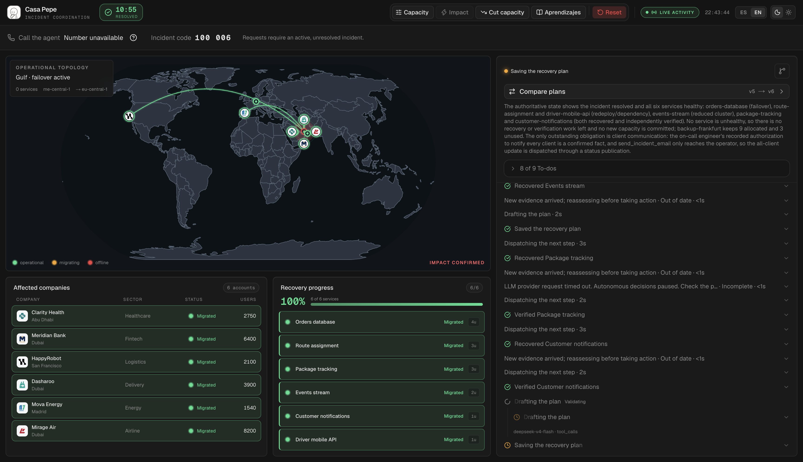
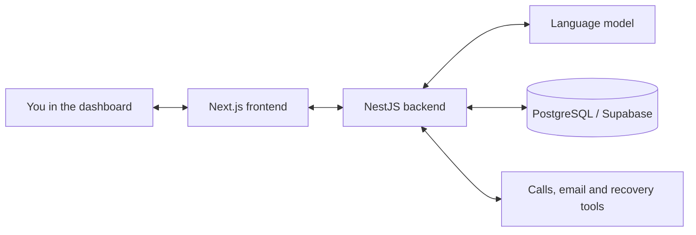

# Casa Pepe

**An AI coordinator that helps manage a service outage—and changes its plan when the situation changes.**

Built over a weekend for **HackSpain 2026**, Casa Pepe explores a simple question: if several services go down and there isn't enough backup capacity to restore everything, what should recover first?

Pepe investigates the incident, weighs the impact on customers, coordinates recovery work and checks the result. You are the operator: you can follow its decisions, introduce new problems, and approve or reject actions that need your permission.

**[Try the live demo →](https://casa-pepe-web.vercel.app/)**



*All six services recovered, with customer status and the agent’s decision history visible alongside.*

[How to try it](#try-it-in-your-browser) · [How it works](#how-it-works) · [Run locally](#run-locally) · [Architecture](Architecture.md)

## The scenario

A fictional delivery company loses its cloud region in Dubai. Its order database, delivery routing, package tracking and other services are affected. Customers need different things back online, but the backup region has limited capacity.

Then the situation gets worse: the backup capacity drops from **four units to one**. Pepe has to reconsider its priorities, explain what can still be recovered and revise work already in progress.

The customers use fictional names and original logos; HappyRobot keeps its name and logo. The incident, customer impact and capacity figures are demonstration data. See [customer branding](packages/demo-brands/README.md) for details.

## Try it in your browser

No local installation is needed to explore the [hosted demo](https://casa-pepe-web.vercel.app/).

1. **Open the dashboard.** A new browser session starts with the system healthy. If you are returning to an old run, use **Reiniciar / Reset** for a fresh start. Choose **ES / EN** before triggering the outage; switching language starts a new run.
2. **Trigger the outage.** Click **Impacto / Impact**. Watch the map, affected companies and activity panel as Pepe investigates and proposes a response.
3. **Change the conditions.** While recovery work is still pending, use **Recortar capacidad / Cut capacity**. The backup now has less room than the original plan assumed.
4. **Inspect the new plan.** Follow what changed, which customers take priority and what has to wait. An approval for an outdated plan cannot authorize its replacement.
5. **Make a decision.** When an approval is requested, review the proposed action and its consequences. Approve or reject it, then follow the recovery and verification results.

The model chooses its next actions, so each run can unfold differently. Refreshing the page preserves your session's incident history; **Aprendizajes** (learnings) shows lessons retained from previous runs in that browser session.

## What is real, and what is simulated?

| Part | What happens |
|---|---|
| AI decisions | A connected language model chooses investigations, proposes plans and selects actions. The server checks whether those actions are allowed. |
| Dashboard and history | Plans, approvals, tool results and activity are stored in PostgreSQL and shown in the interface. |
| On-call engineer | Calls are always simulated and labelled as such. No phone is dialled and no voice subscription is needed. |
| Recovery | Simulated by default. An optional HTTP mode acts on the included test application; it does not create or repair real cloud infrastructure. |
| Email | Simulated by default. Sending real email requires explicitly configuring the Resend integration. |

With the example configuration, the simulated engineer authorizes notifications and traffic failover. That permission is separate from any plan-specific approval required from you.

## How it works

Pepe repeats a loop: **observe → prioritize → act → verify → reassess**.

The language model chooses what to do next. The backend enforces service dependencies, available capacity and required approvals before executing an action. For example, a service that depends on the order database must wait for that database to recover. New evidence can invalidate a plan and its pending approvals.



The frontend uses **Next.js, React and TypeScript**. The backend uses **NestJS and TypeORM**, with **PostgreSQL** for persistence. The model connects through an OpenAI-compatible API; the [example configuration](apps/server/.env.example) includes a Helmcode endpoint. Provider credentials stay on the server.

For the design decisions, approval rules and deployment assumptions, read [Architecture.md](Architecture.md).

## Run locally

You need **Node.js 22+**, **pnpm 11.7.0**, a dedicated **PostgreSQL database** (local or Supabase) and credentials for a language model that supports tool calling. A working model connection is required for autonomous decisions; voice and email accounts are not required.

### 1. Get the code and install dependencies

```bash
git clone https://github.com/SantiagoJimenezQ/hackspain-casa-pepe.git
cd hackspain-casa-pepe
pnpm install --frozen-lockfile
cp apps/server/.env.example apps/server/.env.local
cp apps/web/.env.example apps/web/.env.local
```

### 2. Configure the backend and frontend

In `apps/server/.env.local`, fill in:

| Variable | Value |
|---|---|
| `API_KEY` | A random secret you generate for communication between the frontend and backend. This is separate from your model provider's key. |
| `SUPABASE_DATABASE_URL` | Your PostgreSQL connection string. Despite the name, a local PostgreSQL database also works. |
| `LLM_BASE_URL` | Your model provider's OpenAI-compatible API base URL. |
| `LLM_MODEL` | The provider's model identifier. |
| `LLM_API_KEY` | Your model provider's API key. |

Leave `LLM_PROVIDER` empty when using these generic `LLM_*` settings. For the alternative Helmcode/provider preset configuration, follow the [model setup guide](apps/server/docs/LLM-AGENT.md). Keep email and recovery in their default simulated modes for your first run.

In `apps/web/.env.local`, set `CASA_PEPE_API_BASE_URL=http://localhost:3000` and set `CASA_PEPE_API_KEY` to the **same value as the backend's `API_KEY`**. Both `.env.local` files are ignored by Git; keep credentials there.

### 3. Initialize the database and start the backend

For a **new, empty database**, temporarily set `BROWSER_SESSION_SCHEMA_UPGRADE=true` in the backend environment file, then run:

```bash
pnpm --filter @casa-pepe/server develop
```

Once initialization succeeds and the API starts, stop it with **Ctrl+C**, change the flag back to `false`, and run the same command again. Leave this terminal running. Later starts use `false`; ordinary startup does not create tables.

For an existing database or a Supabase connection, follow the [database setup guide](apps/server/docs/SUPABASE.md). Do not initialize or upgrade a database shared with another running deployment or a PR preview.

### 4. Start the dashboard

In a second terminal, from the repository root:

```bash
pnpm --filter web dev --port 3001
```

Open **[localhost:3001](http://localhost:3001)** and follow the browser walkthrough above. You can also inspect [API health](http://localhost:3000/api/health) and the [interactive API documentation](http://localhost:3000/documentation).

If the dashboard cannot connect, check that the backend is running and both API keys match. If the dashboard loads but Pepe cannot make decisions, check your model settings and provider access. More detail is in the [backend guide](apps/server/README.md) and [frontend guide](apps/web/README.md).

## Explore the code

| Location | Start here to understand… |
|---|---|
| [`apps/web`](apps/web) | The dashboard, live activity and operator controls. |
| [`apps/server/src/agent`](apps/server/src/agent) | How the model observes the incident and chooses actions. |
| [`apps/server/src/plans`](apps/server/src/plans) and [`approvals`](apps/server/src/approvals) | Plan validation, revisions and human approval. |
| [`apps/server/src/recovery`](apps/server/src/recovery) | Recovery execution and the separate verification step. |
| [`apps/server/src/learning`](apps/server/src/learning) | Lessons retained across runs. |
| [`packages`](packages) | Shared data contracts, customer branding and integration helpers. |
| [`demo`](demo) | Rehearsal guides and the optional HTTP recovery test application. |

For endpoint details, see the [API reference](apps/server/docs/API.md) and [curl walkthrough](apps/server/docs/API-CURL-TEST-GUIDE.md). For changes, start with [Contributing](CONTRIBUTING.md) and [Security](SECURITY.md).

## Checks and project scope

Run these from the repository root:

```bash
pnpm run ci
pnpm --filter @casa-pepe/server build
node --test demo/recovery-environment/server.test.mjs
```

These checks cover the frontend, backend and test recovery application using controlled model responses and integrations. Testing against a live model or provider is a separate step.

Casa Pepe is a **weekend hackathon project**, not a production incident-management service. It is designed around one continuously running backend; background scheduling and active execution locks are held by that process. Browser sessions separate visitors' runs, but there are no user accounts or model-usage quotas. A public deployment therefore needs its own access and spending controls.

The [original project plan](MASTER.md) and [HackSpain challenge brief](https://hackspain2026.happyrobot.ai/) provide the project context. Some integration guides describe retained live-provider contracts; the current demo's phone calls remain simulated.
