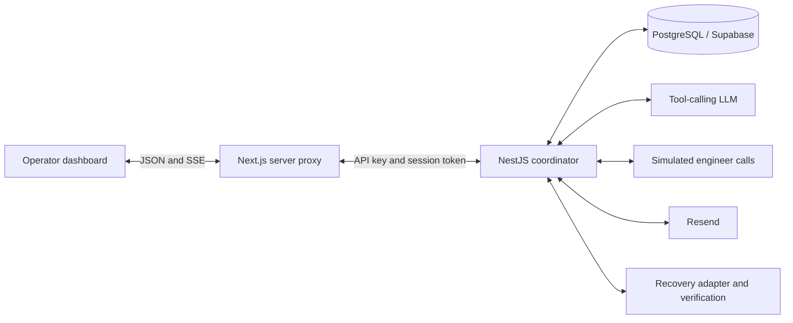

# Casa Pepe

**An AI incident coordinator that revises its plan when the facts change.**

Built for HackSpain 2026, Casa Pepe explores a practical question: when a cloud region fails and backup capacity is scarce, what should recover first—and who should authorize it?

The system investigates a changing incident, proposes recovery priorities, coordinates people and tools, and verifies results. An operator can inspect the evidence, compare plan versions and approve or reject recovery actions.

[Architecture](Architecture.md) · [Run locally](#run-locally) · [Demo walkthrough](#see-the-response-change) · [API reference](apps/server/docs/API.md)

## See the response change

The fictional scenario takes Dubai (`me-central-1`) offline. A delivery platform loses its orders database, route assignment, package tracking and event stream. The nearest backup initially reports four compute units. A later report reduces that capacity to one.

Customers use fictional identities and original logos: Mova Energy, Mirage Air, Meridian Bank, Dasharoo and Clarity Health. HappyRobot retains its name and logo. See [demo branding](packages/demo-brands/README.md) for saved-run compatibility.

1. **Observe:** inspect affected services, dependencies, customer impact and available resources.
2. **Plan:** review the model's priorities, assumptions, selected backup and proposed actions.
3. **Challenge the plan:** use **Cut capacity** or the capacity controls to change the environment while work is pending.
4. **Reassess:** compare the revised plan with its predecessor, including what changed and why. Superseded approvals no longer authorize old work.
5. **Intervene:** approve or reject a current recovery proposal. Track ownership and pending human tasks.
6. **Verify:** check the recovery result independently. In HTTP mode, submit a synthetic delivery to the included recovery application and inspect the returned route.

The model chooses the response; the walkthrough is not a fixed action script. Scenario names, customer examples and resource figures are demonstration data, not claims about real companies or cloud infrastructure.

## Engineering decisions worth inspecting

| Decision | Why it matters | Implementation |
|---|---|---|
| Validate model proposals before execution | Service dependencies, capacity and required approvals remain runtime constraints | [Plans](apps/server/src/plans), [recovery](apps/server/src/recovery) |
| Bind approvals to versioned plans | New evidence can invalidate previously reasonable actions | [Approvals](apps/server/src/approvals), [agent](apps/server/src/agent) |
| Persist evidence and outcomes | Refreshing the dashboard preserves the response history and plan comparison | [Activity](apps/server/src/activity), [overview](apps/server/src/agent) |
| Isolate runs by browser session | Independent visitors can run the scenario without sharing incident ownership | [Session boundary](apps/server/src/authentication) |
| Keep integrations behind adapters | Calls are simulated; email and recovery retain explicit simulated/live modes | [Engineers](apps/server/src/engineers), [tools](packages/tools) |
| Separate execution from verification | An accepted request or completed task is not proof that service recovered | [Recovery](apps/server/src/recovery), [demo target](demo/recovery-environment) |
| Retain lessons across runs | Observed capacity discrepancies and recovery outcomes can inform later decisions | [Learning](apps/server/src/learning) |

## Architecture



**Next.js + React + TypeScript** provide the operator interface. **NestJS + TypeORM + PostgreSQL** own the simulation, agent cycle, plans, approvals, audit history and integration callbacks. The server proxy keeps credentials out of browser code. Shared payload declarations live in `packages/contracts`.

Read [Architecture.md](Architecture.md) for execution boundaries, persistence, browser ownership and deployment tradeoffs.

## Run locally

You need **Node.js 22+**, **pnpm 11.7.0**, a dedicated PostgreSQL database and credentials for a compatible tool-calling LLM. No voice subscription is required. A live email account is optional.

```bash
pnpm install --frozen-lockfile
cp apps/server/.env.example apps/server/.env.local
cp apps/web/.env.example apps/web/.env.local
```

Configure the ignored files:

| File | Settings |
|---|---|
| `apps/server/.env.local` | `API_KEY`, `SUPABASE_DATABASE_URL`, `LLM_BASE_URL`, `LLM_MODEL`, `LLM_API_KEY` |
| `apps/web/.env.local` | `CASA_PEPE_API_BASE_URL=http://localhost:3000`, `CASA_PEPE_API_KEY` matching the backend key |

Use a unique random API key. Leave `LLM_PROVIDER` empty to use the generic `LLM_*` settings, or follow the [LLM guide](apps/server/docs/LLM-AGENT.md) for provider presets. No shared model credentials are distributed with the project. The API can start without them, but autonomous decisions require a working model connection.

**Initialize a fresh database once:** set `BROWSER_SESSION_SCHEMA_UPGRADE=true` in the server environment and start the API. After successful initialization, stop it, restore the flag to `false`, and restart. Ordinary startup does not create tables. For an existing database, back it up and stop older backends before an upgrade. Never enable the upgrade flag on previews sharing another deployment's database.

In separate terminals:

```bash
pnpm --filter @casa-pepe/server develop
```

```bash
pnpm --filter web dev --port 3001
```

Open the [dashboard](http://localhost:3001), [API health](http://localhost:3000/api/health) or [interactive API documentation](http://localhost:3000/documentation). The dashboard manages its session cookie automatically and shows an explicit connection state if the API is unavailable.

Engineer calls are always simulated. Live voice requests and provider callbacks are disabled, even if legacy environment variables still contain credentials or request live mode. Keep email and recovery simulated for the first run; see [backend setup](apps/server/README.md) and [Supabase setup](apps/server/docs/SUPABASE.md) when connecting your own services.

## Validation and scope

```bash
pnpm run ci
pnpm --filter @casa-pepe/server build
node --test demo/recovery-environment/server.test.mjs
```

CI checks the dashboard and backend with scripted model responses and controlled integrations. A live provider rehearsal remains a separate check. The HTTP recovery target operates on the included demo application; it does not provision AWS resources.

This is a **hackathon prototype** designed for one continuously running coordinator. Scheduling, cycle locks and SSE are process-local. Anonymous session ownership separates visitors' runs, but does not provide user accounts, usage quotas or protection against public model spend. Protect hosted operator access before sharing a live demo broadly. Model failures and rate-limit fallback are visible in the runtime. Simulated calls are labelled as such and do not dial a phone.

## Explore the repository

```text
apps/web/             Operator dashboard and server-side API proxy
apps/server/          Incident simulation, agent, persistence and adapters
packages/contracts/   Shared payload declarations
packages/tools/       Server-only integration helpers
packages/agent/       Agent package boundary documentation
packages/harness/     Simulation package boundary documentation
demo/                 Rehearsal guides and HTTP recovery target
docs/                 Design notes and implementation history
```

- [Architecture and tradeoffs](Architecture.md)
- [Backend setup](apps/server/README.md) and [dashboard guide](apps/web/README.md)
- [API reference](apps/server/docs/API.md) and [curl walkthrough](apps/server/docs/API-CURL-TEST-GUIDE.md)
- [Demo rehearsal](demo/README.md) and [integration walkthrough](demo/MVP-TOOLS.md)
- [Contributing](CONTRIBUTING.md) and [security](SECURITY.md)
- [Original project plan](MASTER.md) and [official HackSpain challenge](https://hackspain2026.happyrobot.ai/)
